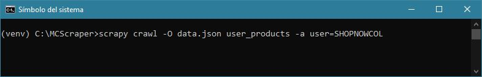
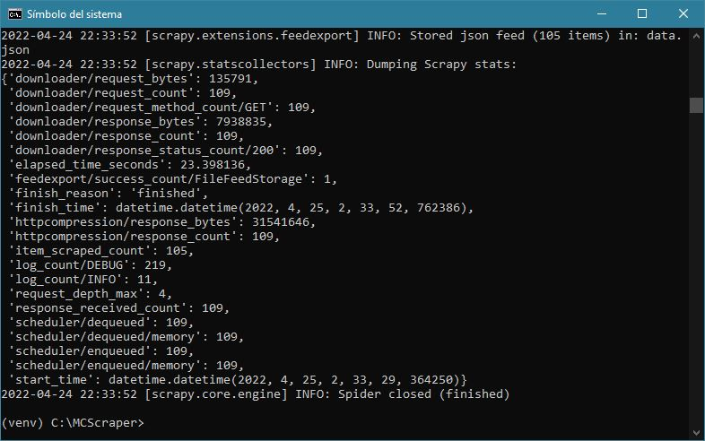
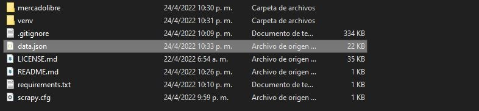

# Mercadolibre Colombia Scraper
The main goal of this scraper is to extract product data from specific users of Mercadolibre Colombia, to be used in competitive analysis. It's made in Scrapy Framework, you only have to add the username of the Mercadolibre account you want to analyze.





## Features
* Username segmentation
* Made in Scrapy Framework
* Fast results

## Installation and running 
To install and run this project copy or clone all the files to your preferred folder and type and execute:

```bash
pip install -r requirements.txt
scrapy crawl -O data.json user_products -a user=username_to_analyze
```
It's recommended to run in a virtual environment. 

Mercadolibre Colombia Scraper was developed under `Python 3.10.0` it should be fine in any Python 3 environment.
